Theory

The following is a team project and we aim at physical implementation of the following model (Non-linear) in future. The following content deals with building a PID based control system for a Remotely operated underwater vehicle(ROV). The main challenge in implementing this is because the bot will be prone to many non-linearities underwater. 

So, the basic mathematical model of an ROV is given by:

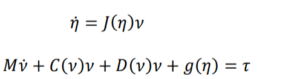

where:
- M = Mass matrix (with added mass effect taken into account)
- C = Coriolis force matrix
- D = Damping forces matrix
- g = Restoring forces matrix
- 𝜏 = Forces & moments matrix

1) **Added Mass Effect:**
The added mass of an object is the effect in which some mass of fluid surrounding the object under observation is accelerated/decelerated along with it.

2) **Coriolis Effect:**
The Coriolis force is a fictitious force that comes into play whenever we are trying to explain the forces on an object with respect to a rotating frame.

3) **Ziegler-Nichols Method for tuning PIDs:**
This method can be used to tune our PID both in the case where we have a working model for our plant or even when we don’t. The first step to this method is measuring two parameters: KU which is the gain at which the system becomes marginally stable and TU which is the period of oscillation at marginal system response. These values are found by taking KI and KD values to be zero for that input and changing KP until marginal stability is achieved.
After these parameters are evaluated controller gains can simply be calculated from the below table:

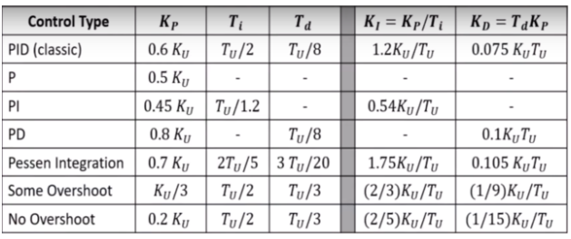

4) **Controller Models:**
The two controller models that we used are:
A. **Linear Model:**
The schematic of the simulink model created using the linear PID control looks like this:

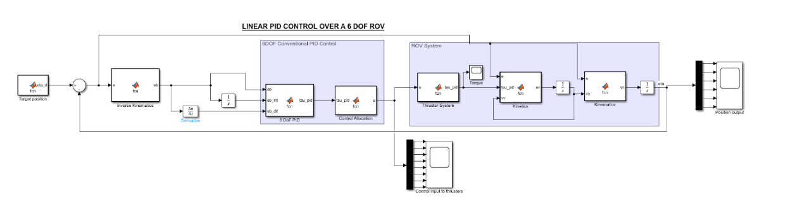

It consists of different functionalities in each block of the design:

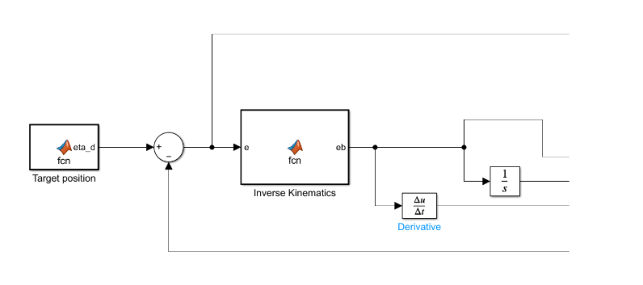

The PID controller uses an error signal, called the tracking error, generated from the difference between the desired position and the current position of the rover. 

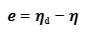

This error signal, in the world frame, is converted to the error signal in body frame 𝑒b using the following equation:

where the transformation matrix from the vehicle body frame to the world reference frame using Euler angle transformation is given by:  

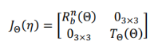

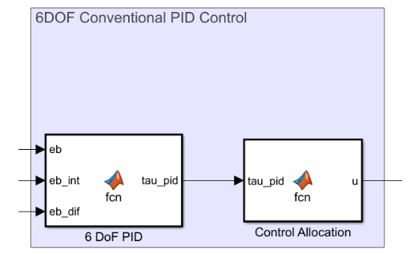

Using the error signal in the body frame 𝑒b, the torque generated by the PID can be calculated using the equation:

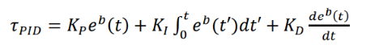

In order to generalize the required control forces, control allocation calculates the control input signal u to apply to the thrusters. The control forces due to the control inputs applied to the thrusters can be expressed as:

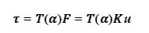

As a result, the control input vector can be derived as:

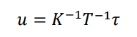

For the linear model, the following values of KP, KI, and KD have been obtained using the Ziegler-Nichols method:

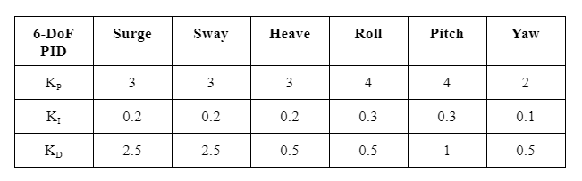

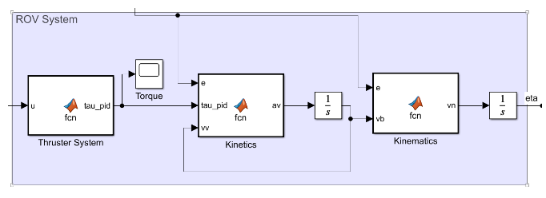

Using the control input vector, the thruster system generates the control forces in 6 DoFs with the help of the above mentioned equation:

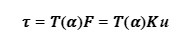

 
Since the 8 thrusters of the ROV produce a maximum thrust of 40N at operating voltage of 16V, the thrust coefficients are approximated to 40. Thus the thrust coefficient matrix 𝐾 is taken as:

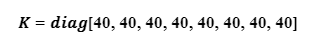

 
After obtaining the torque vector, the kinetics is used to determine the acceleration in the body frame for the given forces using the state equation:

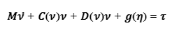

The kinematics block is then used to define the vehicle velocity in the world frame 𝑣n. The position of the vehicle is then determined in the integrator and, using inverse kinematics, is converted to the body frame before being supplied back into the controller.

B. **Non-Linear Model:**
Because of disturbances underwater like current speed, there will be non-linearities introduced into the system. This makes the linear-PID controller model inappropriate to use as there will be a lot of deviations from the desired o/p and noise in the system. So, we need to include the system dynamics to get the control input to the thrusters. 
In the nonlinear model-based PID control system design, the dynamic model of the ROV is utilized to produce a 6-DoF predictive force and the model-based PID is used to provide a corrective force in 6 DoFs to adjust the error in the model. This is advantageous in that the model error and nonlinearities tend to be smaller than the dynamics themselves.
In the predictive force generation, a virtual reference trajectory strategy is introduced for the design of trajectory tracking. With the use of a scalar measure of tracking in Fossen (Fossen, 1994), a virtual reference 𝑥𝑟 can be defined that satisfies:
𝑥𝑟_dot = 𝑥𝑑̇ _dot+ 𝜆𝑒𝑏

where 𝜆 > 0 is the control bandwidth that describes the amount of tracking error to the overall tracking performance, and 𝑒𝑏
is the tracking error in the body frame. 
Since the velocity 𝑣 is the time derivative of the position (i.e. 𝑣 = 𝜂̇), for a defined virtual reference position 𝜂𝑟, the following is satisfied:
𝑣𝑟 = 𝑣𝑑 + 𝜆𝑒b

So, lambda(𝜆) is used to tune the 6-DoF predictive force.
This is shown in the following block:

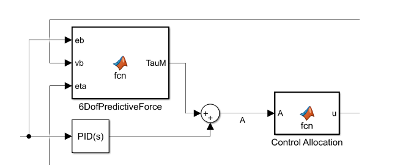

Where ‘A’ is the new controller output.

The PID controller gains(Kp, Ki and Kd) for the non-linear model are found out by Ziegler Nichols method and were found out to be as follows:

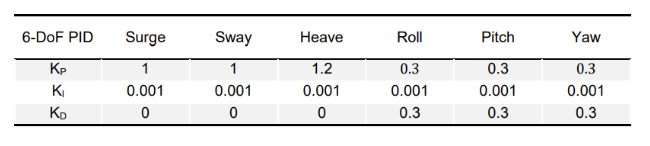

Finally, the control law for the nonlinear model-based PID controller is computed given by:

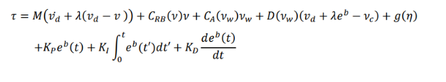

The final model for this system is shown below:

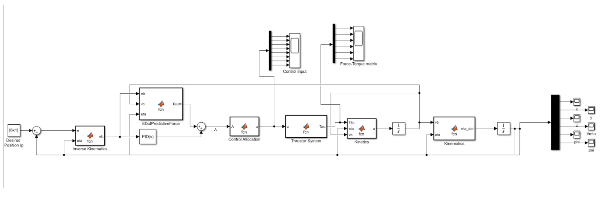

Here, we took desired position input as [1; 1; 2; 0; 0; 0].

## **Implementation:**
We implemented the models for both the controllers above and got the following results when we give a desired positional input:
1) **Linear Controller Model:**
Using the above method, we have obtained the following results for a desired position input: eta_d = [3;4;1;1.57;0;0].
The output of the position and orientation control is obtained as follows:

**Position X :**
Desired output: 3m
Obtained result:

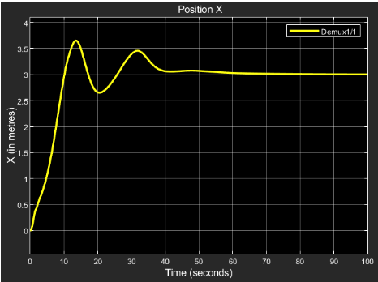

The steady state response final value = 3.

**Position Y :**
Desired output: 4m
Obtained result:

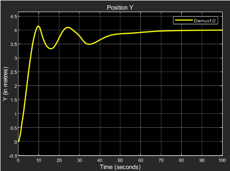

The steady state response final value = 4.

**Position Z :**
Desired output: 1m
Obtained result:

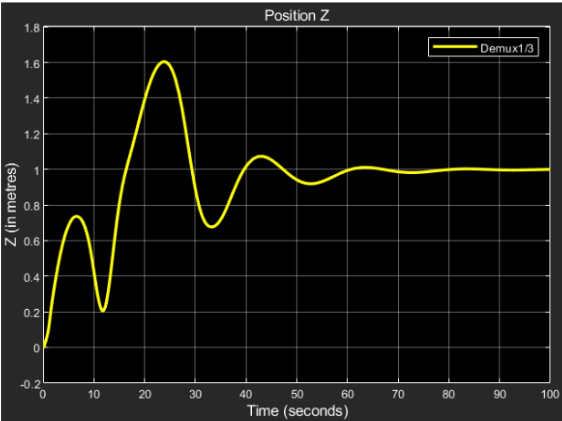

The steady state response final value = 1.

**Orientation 𝛷 :**
Desired output: 1.57 radians
Obtained result:

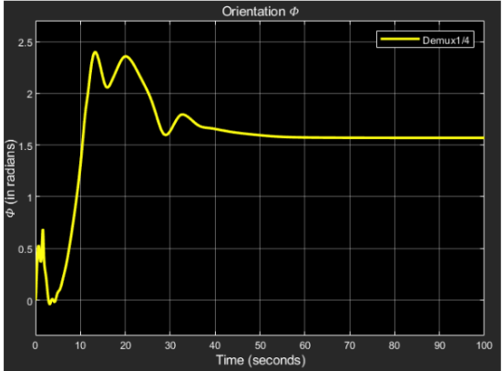

The steady state response final value = 1.57.

**Orientation 𝛳 :**
Desired output: 0 radians
Obtained result:

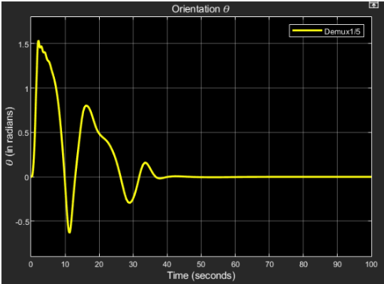

The steady state response final value = 0.

**Orientation 𝛹 :**
Desired output: 0 radians
Obtained result:

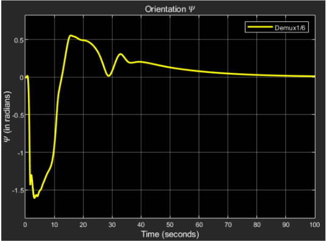

The steady state response final value = 3.

 The control inputs to the thrusters for the same are represented in the plots below:

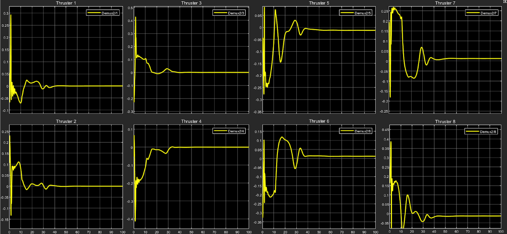

 As it is evident from the plots, each thruster is instructed to provide the required thrust every instant for a finite period of time after which the control input eventually settles down to a final value.
 
The model of the rover under study somewhat looks like this:

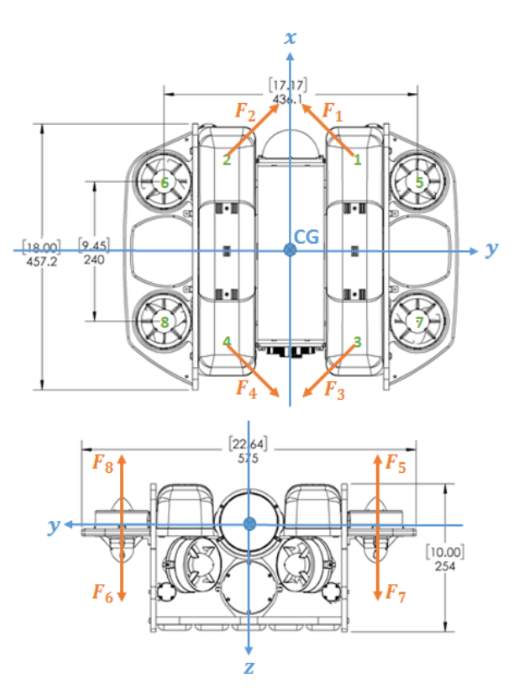

Here, the thrusters 1,2,3,4 are used in the position control in the X,Y directions while 5,6,7,8 are used for the Z-directional control. If we see the plots for the thruster control inputs for 1,2,3,4:

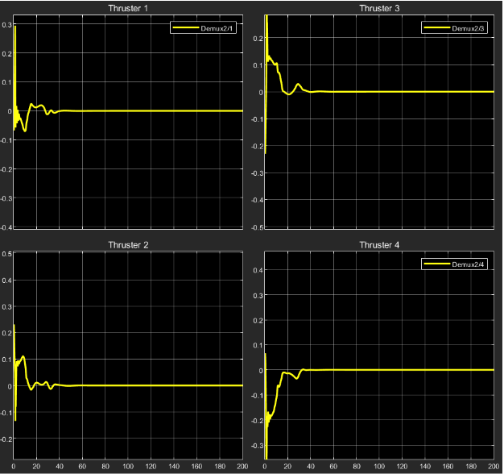

We can observe the steady state final value to be zero for all the thrusters 1,2,3,4. 

**Reason:** The above thrusters are used for controlling the position in X,Y directions and their respective control inputs drive them to work in a synchronized manner so as to reach the respective position. Once the rover has reached the required X,Y, coordinates of the position with the required orientation, there is no need for them to provide any more thrust given the lack of any external force acting in the X,Y directions.

The interesting part comes when we observe the control input plots for the thrusters 5,6,7,8:

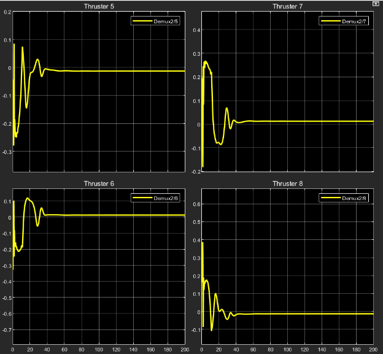

As it is observed, each of the control inputs have a non-zero steady state value; positive for thrusters 6,7 and negative for thrusters 5,8. 

**Reason:** Thrusters 5,6,7,8 are used for positional control in the Z direction. When the rover moves to the desired Z coordinate position in the required orientation, the job of the thrusters is not done since the position has to be retained while neutralizing an external force. This external force is the buoyancy acting upon the rover since it is designed to be positively buoyant. The values of forcing acting due to weight and buoyancy for the rover under study are:

W = 112.8 N
B = 114.8 N ; 
this implies that the net external force acting on the rover is 2N upwards.
When we look at thrusters 5,8 ; they provide a thrust vertically upwards when rotated clockwise while thrusters 6,7 produce a thrust vertically downwards for the same. This means that for thrusters 5,8 positive thrust is upwards while negative thrust is downwards. This is opposite in the case of thrusters 6,7 From the plots of control inputs to the above thrusters, the steady state values are as follows:
For thrusters 5,8: -1.25*10-2 (approx.)
For thrusters 6,7: +1.25*10-2 (approx.)
Thrust produced by thrusters 5,8 is negative, which implies that thrust is produced in the  vertically downwards direction.
Thrust produced by thrusters 6,7 is positive, which again implies that thrust is produced in the vertically downwards direction.
Total thrust produced T = K*u where K= 40 for all the thrusters.
Total thrust produced in steady state: 4*1.25*10-2 *40 N = 2 N downwards. 
Since the external force in Z direction has been neutralized, the rover is stabilized once it reaches the desired position.

This is how the positional control of the underwater rover has been established using the linear PID control method.

2) **Non-Linear Controller Model:**
For desired positional input as [1; 1; 2; 0; 0; 0], we got the following results for positional coordinates in world frame:
**Position X :**
Desired output: 1 m

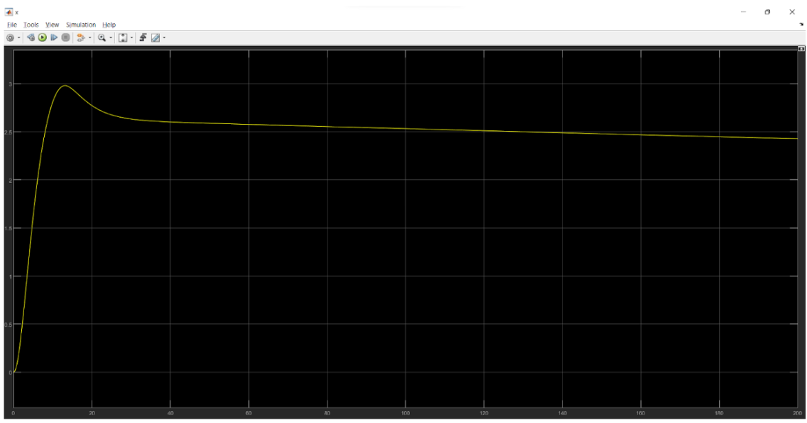

**Position Y :**
Desired output: 1 m

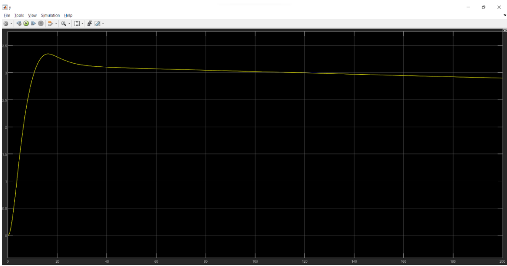

**Position Z :**
Desired output: 2 m

**Orientation 𝛷 :**
Desired output: 0 rad

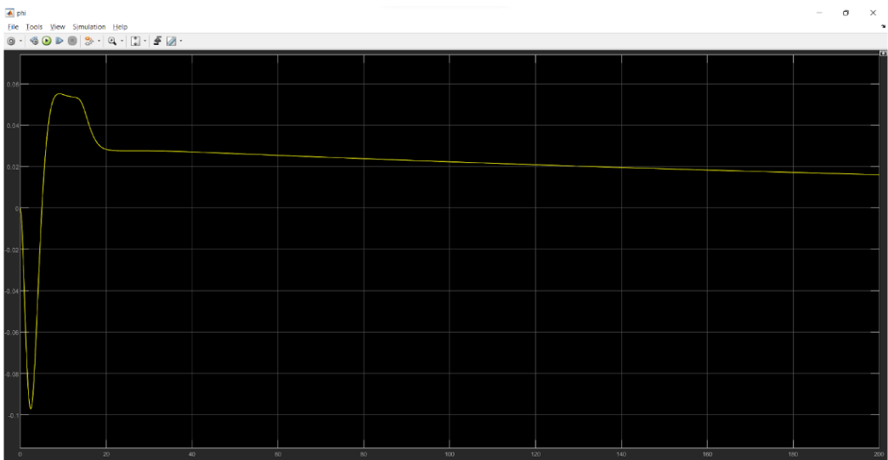

**Orientation 𝛳 :**
Desired output: 0 rad

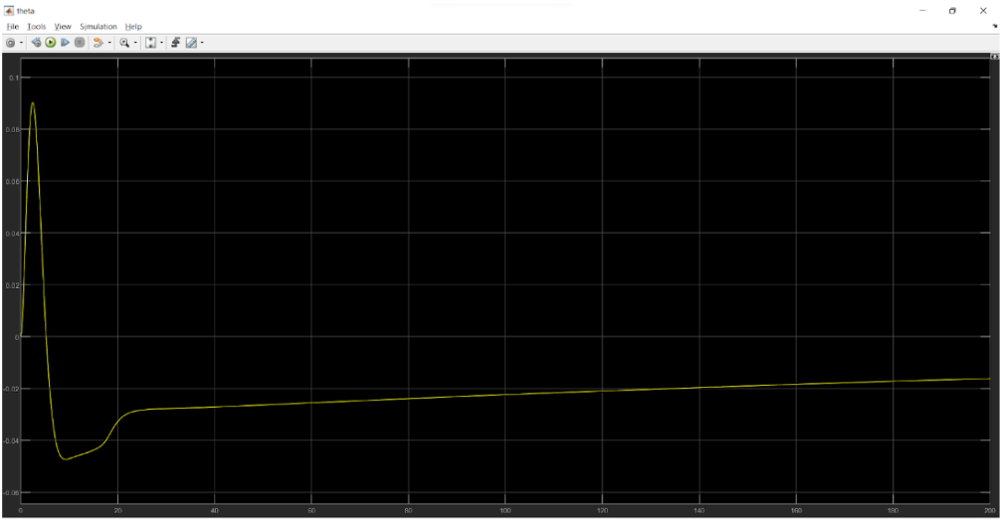

**Orientation 𝛹 :**
Desired output: 0 rad

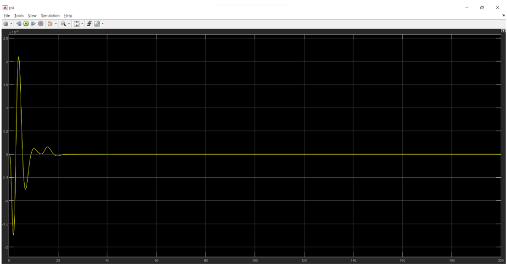

The controller input plots (controller input for each thruster will be as follows):

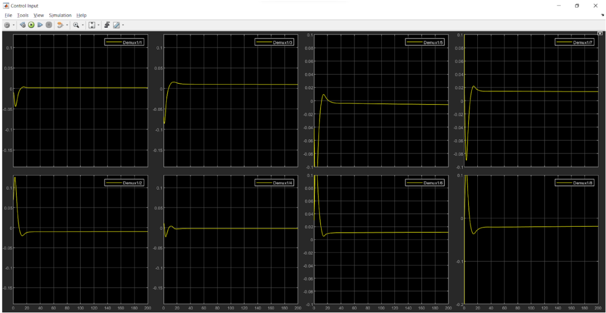

So, we can see that the thrust control input for thrusters 5,6,7 and 8 will be: -1.375e-02, 1.375e-02, 1.375e-02, -1.375e-02 respectively.
Now, since propeller pair of 5 and 8 will be opposite to that of the pair 6 and 7, we get the total thrust on the ROV in Z-direction as:
1.375e-02*4*40 = 2N (approx.), where 40 is the gain. 
So, the force in the vertical direction is balanced.

The Non-linear model above is made as an extension to the linear model and its Simulink model is available in my Github Repository. 

For the above work, we referred to the following article:
- https://flex.flinders.edu.au/file/27aa0064-9de2-441c-8a17-655405d5fc2e/1/ThesisWu2018.pdf

We next plan at implementing our model with LQR controller. 

---

